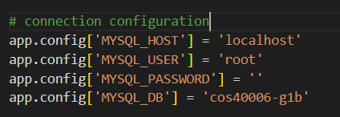

# backend

## Setup database
Import "cos40006-g1b.sql" file to MySQL

## Install requirements 
```sh
pip install -r requirements.txt
```

## Config connection from Flask app to MySQL database
Open app.py file, config the connection correctly


## run the api
```sh
python app.py
```


